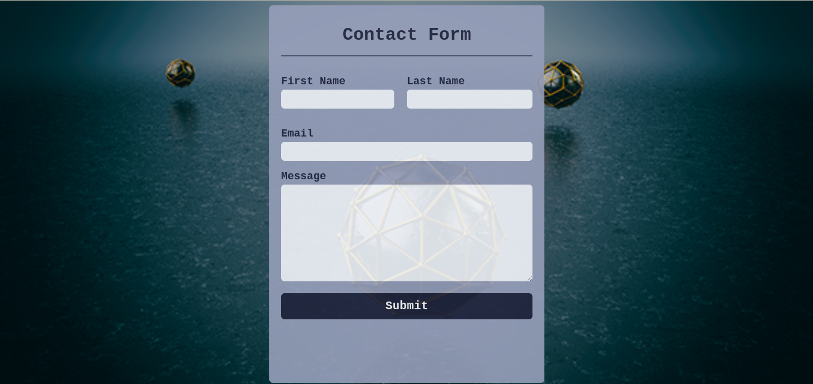
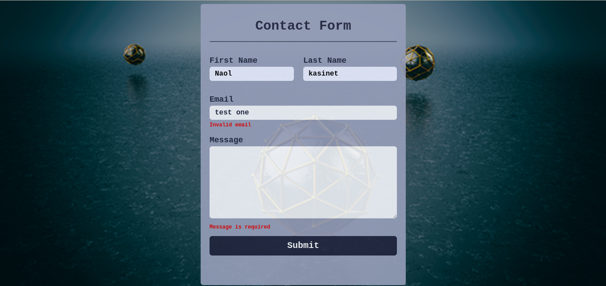
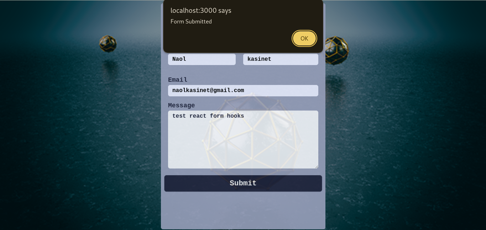

# Contact Form Project

This project is a simple contact form built with React and validated using React Hook Form. Users can submit their first name, last name, email, and message.

## Table of Contents

- [Features](#features)
- [Installation](#installation)
- [Usage](#usage)
- [Demo](#demo)

## Features

- Input fields for first name, last name, email, and message
- Form validation using React Hook Form
- Error messages for invalid inputs
- Submission handling

## Installation

1. Clone the repository:

   ```sh
   git clone https://github.com/Naol86/projectPhase.git
   ```

2. Navigate to the project directory:

   ```sh
   cd task-5
   ```

3. Install the dependencies:

   ```sh
   npm install
   ```

## Usage

1. Start the development server:

   ```sh
   npm start
   ```

2. Open your browser and navigate to `http://localhost:3000` to see the contact form.

## Demo

### Landing Page



### Validation Errors



### Successful Submission


